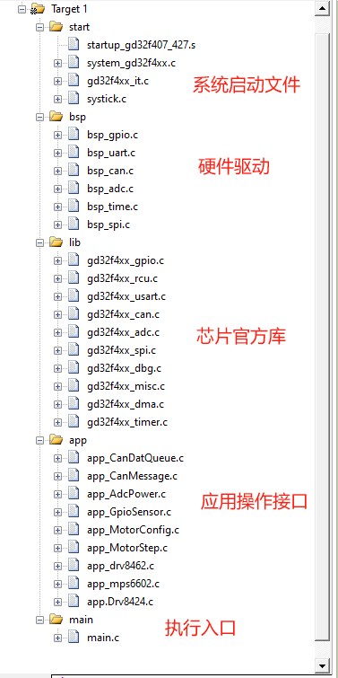
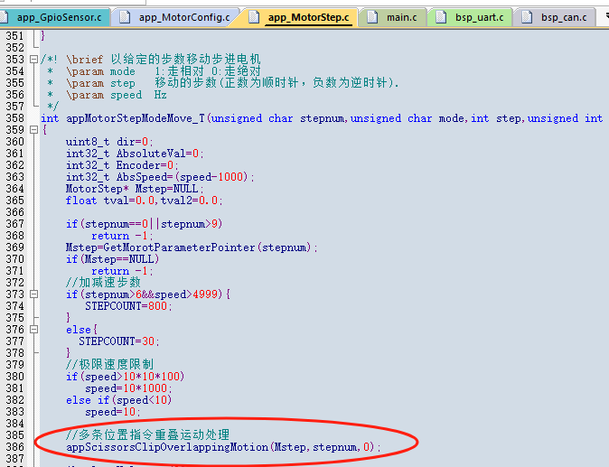

# 驱动接口及电机应用函数说明
#### 工程文件层次
  
### 上电初始化流程
~~~
|─startup_gd32f407_427.s
  |_int main(void)
      ├─systick_config()           "开启systick中断时基1ms"
      ├─bsp_uart0_int()            "printf调试打印接口"
      |_appGpioSetsInit()          "IO初始化" 
      |  |_bsp_led_init()                           "系统灯初始化"
      |  |_bsp_Out24V_init()                        "24V5路输出8803故障输出输入"
      |  |_bsp_Sensor_iniit()                       "传感器检测初始化"
      |  |_bsp_Dipswitch_init()                     "拨码开关检测初始化"   
      |  |_bsp_StepperMotorMicrostep_init()         "电机细分初始化"
      |  |_bsp_StepperMotorEN_DiR_FUAL_NRST_init()  "电机使能,方向,故障检测,复位"
      |_appCanMessageInit()        "CAN消息应用初始化"
      |  |_bsp_can0_init()                          "Can硬件配置"
      |  |_CanDataEnQueueCallback                   "数据入队回调函数指针地址赋值"
      |  |_appCanQueueInit();                       " 接收数据队列配置"
      |_appMotorStepInit()         "步进电机控制初始化"
      |  |_Step1_TIM1InterruptCallback              "脉冲中断处理回调函数_1"
      |  |          :                               
      |  |_Step9_TIM12InterruptCallback             "脉冲中断处理回调函数_9"
      |  |_bsp_TimexStep_init()                     "第1路定时器初始化"
      |  |          :
      |  |_bsp_TimexStep_init() ()                  "第9路定时器初始化"
      |  |_app_NineStepperMotorsDefaultParameter()  "9路电机上电默认参数"     
      |  |_appDrv8424Init()                         "剪刀夹子,PWM,config"
      |  |_appDrv8462Init()                         "升降,spi1Init,config" 
      |  |_appMps6602Init()                         "拉线,spi0Init,config" 
      |_appPowerDetectionInit()    "电源检测初始化(DMA轮询方式)"
    while(1)
    {  //指示灯状态翻转ms
       app_System_Led(500) 
    }
~~~
### 函数接口说明
## systeme
~~~
开启了systick中断时基1ms,中断优先级最低,程序中所用到的时间都基于此
void SysTick_Handler(void)
~~~
## GPIO
~~~
#include "app_GpioSensor.h"
"指示灯状态翻转time:间隔时间"
void app_System_Led(unsigned short)
"获取拨码号 return bit-ID0 bit-ID1"
unsigned char appGetDipSwitchNum(void);
"4路输出DRV8803复位"
void appDrv88033_RST(void);
"获取Drv8803故障状态 低有效"
unsigned char appGetDrv88033FaultStatus(void);
"
5路输出操作 1-4路：DRV8803 - 高有效  第5路  ：开漏输出- 高有效 
num   : 1-5路  0-全部
status: 1-开  0-关
return: -1-参数传入错误 1-执行完成 0-未执行   
"
int  appRead5wayOutputPinStatus(unsigned char);
"
读5路输出管脚状态
num   : 1-5路   0-全部: bit0-out1,bit1-out2, bit2-out3,bit3-out4,bit4-out5
return: -1-参数传入错误  1-执行完成 0-未执行   
"
int  app5wayOutputEnWrite(unsigned char,unsigned char);
"
获取传感器状态
num   : 1-24路 
        0-全部: bit0-IN0...bit23-IN27
return: -1-参数传入错误  
"
int  appGetSensorStatus(unsigned char);
~~~
## uart0
~~~
用于printf调试打印接口，波特率默认115200bps,
bsp_uart.h提供以下接口; 宏定义LOG_ENABLE为打印开关
#define LOG_ENABLE      1
#if LOG_ENABLE 
    #define log_info(...)    printf(__VA_ARGS__)
    #define log_error(...)   printf(__VA_ARGS__)
    #define log_warning(...) printf(__VA_ARGS__)
    #define log_debug(...)   printf(__VA_ARGS__)
#else
    #define log_info(...)
    #define log_warning(...)
    #define log_error(...)
    #define log_debug(...)
#endif
#define log_funcName()   log_debug("call %s \n", __FUNCTION__)
~~~
## can0
~~~
波特率默认1Mbps，开启接收中断,中断优先级最高,接收ID与掩码为列表模式可通过条件编译修改
 /* 1MBps */
#if CAN_BAUDRATE == 1000
      can_parameter.prescaler = 2;
#elif CAN_BAUDRATE == 500
      can_parameter.prescaler = 4;    
#elif CAN_BAUDRATE == 250
      can_parameter.prescaler = 8;      
#endif   
/*列表模式接收ID*/
#ifdef CANREVIDBASS_2
    can_filter.filter_number=1;
    can_filter.filter_list_high = (CANREVIDBASS_2)<<5; 
    can_filter.filter_mask_high = (CANREVIDBASS_2)<<5;    
    can_filter_init(&can_filter);
    #endif 
    #ifdef CANREVIDBASS_3
    can_filter.filter_number=2;
    can_filter.filter_list_high = (CANREVIDBASS_3)<<5; 
    can_filter.filter_mask_high = (CANREVIDBASS_3)<<5;    
    can_filter_init(&can_filter);    
#endif
app_CanDataQueue.c为数据队列操作，接收数据入队已在void CAN0_RX0_IRQHandler(void)完成
#include "app_CanMessage.h"
#include "app_CanDataQueue.h"
"循环队列长度"
#define  CANDATALEN  50
"队列操作句柄"
Queue    CanRevQueue;                          
"CAN队列缓存区"
ElemType CanDataBuff[CANDATALEN]	            
"接收数据入队回调"
void (*CanDataEnQueueCallback)(void *dat)       
"循环队列入队"
int appCanDataEnQueue(Queue* q, ElemType *data) 
"循环队列出队"
int appCanDataDeQueue(Queue* q, ElemType *val) 
"Can0发送消息"
int appCanDataSend(unsigned char *data,unsigned char len,unsigned short id)
~~~
## ADC_DMA
~~~
#include "app_AdcPower.h"
"
获取检测电压值(0-3.3)未滤波
DC12V:12V电压值
DC24V:24V电压值
"
int appGetPowerVoltageValue(float* DC12V,float* DC24V)
"
获取检测实际电压值(0-12/24V)未滤波
DC12V:12V电压值
DC24V:24V电压值
"
int appGetPowerActualVoltageValue(float* DC12V,float* DC24V)
~~~
## StepMotor
___
### config  
~~~
#include "app_MotorConfig.h"
"9路电机上电默认参数赋值  -运行电流 -锁定电流 -电机运动默认正方向"
void app_NineStepperMotorsDefaultParameter(void);
"9路电机使能/失能设置 num: 1-9  0-全部;  En: 0/!0  "
int appNineMotorEnbleSet(unsigned char num,unsigned char Enb);
"电机故障状态获取(低电平有效) num: 1-9 bit0;  0-全部 bit0--bit8"
int appNineMotorGetFaultStatus(unsigned char num);
"
9路电机电流设设置并记录 因三款电机IC电流调节方式差别大故不支持群操作
特殊使用对应IC接口(drv8424,drv8462,mps6602)
num: 1-9 
current:电流值
"
int appNineMotorRunCurrentSet(unsigned char num,unsigned short current);
"
9路电机锁定电流设设置并记录 因三款电机IC电流调节方式差别大故不支持群操作,
特殊使用对应IC接口(drv8424,drv8462,mps6602)
num: 1-9 
current:电流值
"
int appNineMotorLockCurrentSet(unsigned char num,unsigned short current);
"
9路电机细分设置(上电默认配置4细分)因三款电机IC细分调节方式差别大紧支持4种情况
特殊使用对应IC接口(drv8424,drv8462,mps6602))
num: 1--左剪刀,右剪刀
     2-右夹1,右夹2,左夹1,左夹2
     7-升降电机
     8/9-拉线电机   
     0-全部 
microstep:  0-全步  
            2-1/2步 
            4-1/4步  
            8-1/8步
"
int appNineMotorMicrostepSet(unsigned char num,unsigned char microstep);
~~~
#### StepMove
~~~
bsp_Time1Step_init()bsp_Time2Step_init()bsp_Time4Step_init()bsp_Time5Step_init()
bsp_Time6Step_init()bsp_Time9Step_init()bsp_Time10Step_init()bsp_Time11Step_init()
bsp_Time12Step_init();9个定时器开启的定时中断优先级均是最高与CAN接收一样
"
appMotorStepModeMove_T()与appMotorSpeedModeMove_T()用那个位置编码值EnCoder都会更新
所以两种模式尽量不混用,特殊场景下必须混用注意SpeedMode转到StepMode要执行回零校准
"
~~~

~~~
#include "app_Motorstep.h"
"
多条位置指令重叠运动处理(阻塞) appMotorStepModeMove_T中调用此函数接口
tye：1:终止当前运动减速停机,阻塞时间STEPCOUNT个脉冲周期(保障最后一条位置指令)
    !1(默认):等当前运动结束,阻塞剩余N个未走完脉冲周期(重叠位置指令都能走完位置）    
mtn:电机编号
"
static int appScissorsClipOverlappingMotion(MotorStep* Mstep, uint8_t mtn,uint8_t tye)
"   \brief 以给定的步数移动步进电机
 *  \param mode   1:走相对 0:走绝对 
 *  \param step   移动的步数(>0正转，<0反转).
 *  \param speed  Hz
"
int appMotorStepModeMove_T(unsigned char stepnum,unsigned char mode,int step,unsigned int speed)         
"   \brief 以给定的速度移动步进电机
*   \param  stepnum:电机编号 1-9
*   \param speed(Hz):>0正转，<0反转  ==0减速停止
"
int appMotorSpeedModeMove_T(unsigned char stepnum,int speed)
~~~
___